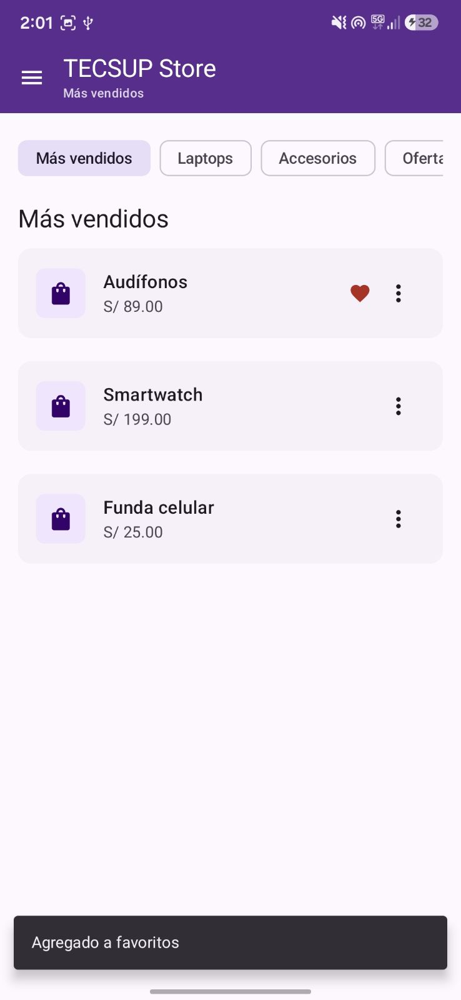
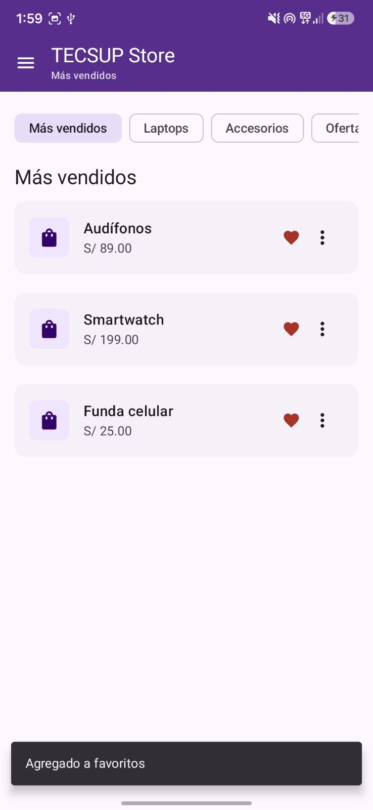
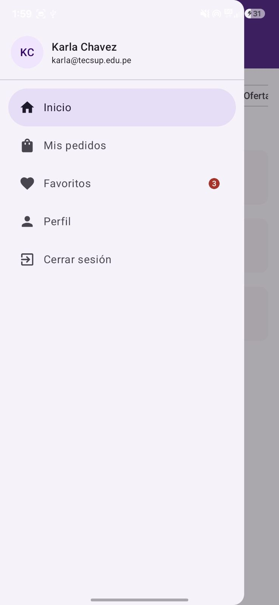
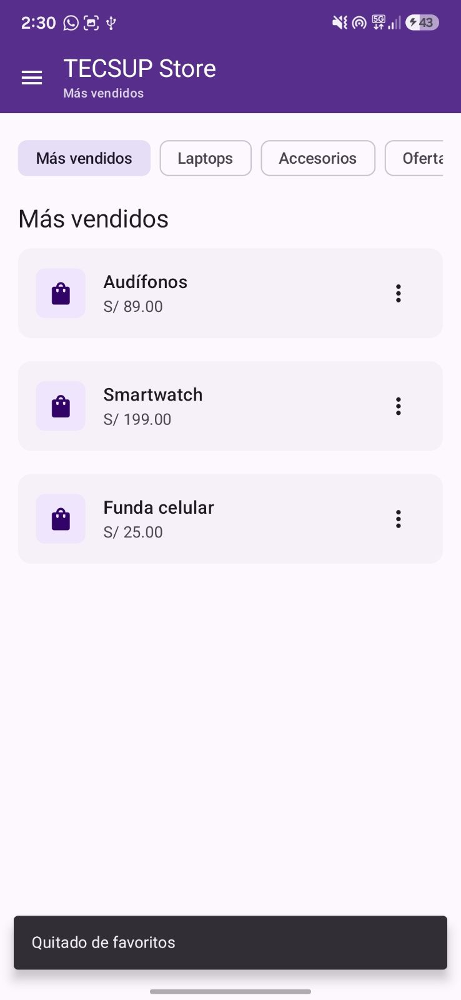

# Laboratorio 06: Menú y Navegación (TECSUP Store) · Fase 2 con IA

**Curso:** Programación en Móviles · Diseño y Desarrollo de Software · 4to ciclo
**Alumna:** Karla Estefany Chavez Lazo
**Docente:** Juan José León Suiyon
**Rama:** `CON-IA` 
**Proyecto:** TECSUP Store (Jetpack Compose, Material 3)

## Objetivo de la Fase 2
Con ayuda de un asistente de IA, conectar las dos piezas del laboratorio construidas en la Fase 1: una acción en el **DropdownMenu** de cada producto (marcar como favorito) debe reflejarse visualmente en el **NavigationDrawer** mediante un **badge con contador** en el ítem "Favoritos".

## Mejora : badge de favoritos

### Cómo funciona (estado elevado)
1. `AppNavigation` guarda los ids de los productos favoritos en un `mutableStateListOf<Int>()`.
2. Hacia abajo, `HomeScreen` y cada `TarjetaProducto` reciben `esFavorito` y la función `onToggleFavorito`.
3. La opción "Favoritos" del menú ⋮ llama a `onToggleFavorito`, que agrega o quita el id de la lista.
4. Hacia el drawer, `AppNavigation` pasa `favoritos.size` a `AppDrawerContent`, que lo muestra en un `Badge` dentro del `NavigationDrawerItem`. El badge se oculta cuando el contador es 0.

Como la lista es un estado observable de Compose, al cambiarla se redibujan automáticamente la tarjeta y el drawer.

### Archivos modificados
| Archivo | Cambio |
|---|---|
| `components/TarjetaProducto.kt` | Parámetros `esFavorito` y `onToggleFavorito`; la opción del menú alterna el favorito |
| `screens/HomeScreen.kt` | Recibe `favoritos` y `onToggleFavorito` y los pasa a cada tarjeta |
| `screens/AppNavigation.kt` | Contiene el estado de favoritos y pasa el contador al drawer |
| `components/AppDrawer.kt` | Parámetro `cantidadFavoritos` y `badge` en el ítem "Favoritos" |

## Mejoras adicionales
- **Corazón animado** (`AnimatedVisibility`) en la tarjeta de los productos favoritos.
- **Snackbar** con el mensaje "Agregado a favoritos" o "Quitado de favoritos" al usar la opción del menú.
- La opción del menú cambia de texto e ícono según el estado: "Favoritos" con corazón vacío, o "Quitar de favoritos" con corazón lleno.

## Control de versiones
Commits de la Fase 2 (ajustar si se usaron otros mensajes):
1. Agregar parámetros de favorito a `TarjetaProducto` y opción alternable en el menú.
2. Elevar el estado de favoritos a `AppNavigation` y conectarlo a `HomeScreen`.
3. Mostrar badge con contador de favoritos en el drawer.
4. Agregar corazón animado y Snackbar al marcar favoritos.
5. Documentar prompts y README de la Fase 2.

Los prompts utilizados están documentados en [`PROMPTS.md`](PROMPTS.md).

## Capturas

*Figura 1. Menú contextual (⋮) abierto sobre "Audífonos", con las opciones Favoritos, Compartir y Reportar.*

*Figura 2. Producto "Audífonos" marcado como favorito: aparece el corazón rojo en la tarjeta y el mensaje "Agregado a favoritos".*

*Figura 3. Los tres productos marcados como favoritos, cada uno con su corazón animado.*

*Figura 4. NavigationDrawer con el ítem "Inicio" resaltado y el badge con el contador (3) en "Favoritos", reflejando los productos marcados desde el DropdownMenu.*

*Figura 5. Al quitar los favoritos desde el menú, los corazones desaparecen y aparece el mensaje "Quitado de favoritos".*

## Preguntas de reflexión (Fase 2)

**3. ¿Cómo estructuré mi código para que el contador de favoritos del drawer se entere de lo que pasa en el DropdownMenu?**
Elevé el estado (*state hoisting*) a `AppNavigation`, el único componente que ve a la vez al drawer y a la pantalla con las tarjetas. Ahí vive la lista de favoritos. Hacia abajo se pasan `esFavorito` y `onToggleFavorito`; hacia el drawer se pasa solo la cantidad (`favoritos.size`). Así la tarjeta no conoce al drawer ni el drawer a la tarjeta: ambos dependen del mismo estado.

**4. ¿Qué tuve que corregir del código que me generó la IA?**
- Al reemplazar la firma de `TarjetaProducto` se perdió la línea `var expanded by remember { mutableStateOf(false) }`, y todas las apariciones de `expanded` quedaron en rojo. Hubo que volver a declararla debajo de la firma.
- Al reemplazar la tarjeta en `HomeScreen` se perdió la línea `items(listaProductosPrueba) { producto -> ... }`, por lo que `producto` no estaba definido. Hubo que restaurarla.

## Observaciones
1. El repositorio tenía archivos generados (`.idea`, `build`, `local.properties`) que no deben subirse. Agregué un `.gitignore` en la raíz y dejé de rastrearlos, lo que además corrigió el porcentaje de lenguajes de GitHub (mostraba 74% HTML por reportes de Gradle).
2. Al traer `SIN-IA` a `CON-IA` aparecieron conflictos en archivos de `.idea` y en un README editado desde GitHub. Los resolví manteniendo las eliminaciones de `.idea` y la versión remota del README, sin tocar código.
3. El estado de favoritos vive en `remember`, así que se reinicia si se rota la pantalla o se cierra la app. Para persistirlo haría falta `rememberSaveable` o una base de datos.
4. El ítem "Favoritos" del drawer cambia la ruta activa, pero todavía muestra la misma `HomeScreen`, porque el laboratorio no pide una pantalla de favoritos.

## Conclusiones

1. La Fase 1 me obligó a entender cada pieza (`expanded`, `ModalDrawerSheet`, `selected`) porque no tenía a dónde acudir cuando algo fallaba. Fue más lenta, pero entendí por qué funciona cada línea.
2. En la Fase 2 la IA propuso rápido la estructura del badge, pero el código no encajó solo: hubo que revisar qué línea se perdía y dónde conectar el estado. Sin haber hecho la Fase 1 no habría sabido detectar esos errores.
3. Concluyo que la IA acelera el trabajo cuando ya se entiende la base, y que revisar y corregir lo que genera es parte del trabajo, no un paso opcional.